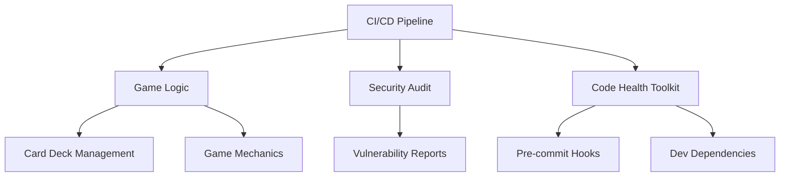

<!-- Generated by arch_map.py on 2026-05-18 -->

# Architecture — blackjack

## Overview
This project is a blackjack card game implementation with integrated CI/CD pipelines, security auditing, and AI-assisted development workflows. It includes production deployment configurations, dependabot automation, and comprehensive documentation for code health and security practices.

## Component map

## Key modules
| Module | Purpose | Dependencies |
|--------|---------|--------------|
| .github/workflows/ci.yml | CI/CD pipeline configuration | None |
| .github/dependabot.yml | Automated dependency updates | None |
| code-health-toolkit-v4/ | Code quality and development tools | pre-commit, pyproject.toml |
| src/assets/sounds/ | Game audio resources | None |
| PRODUCTION_MANDATE.md | Production deployment requirements | None |
| SEC_AUDIT.md | Security audit documentation | None |

## External dependencies
- pre-commit (from code-health-toolkit-v4)

## Data flow
Configuration files and audit documents are processed through CI/CD workflows, which trigger game logic execution and security validation.

## Known risks / open questions
- No Python source files found in src/ directory; game logic implementation is missing
- PRODUCTION_MANDATE.md and SEC_AUDIT.md may contain redundant or conflicting requirements
- Audio assets directory (sounds/) is empty
