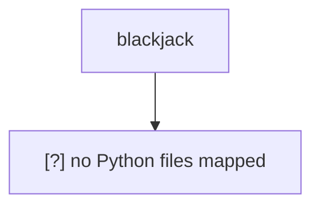

# Architecture

## Overview
- Project root: `blackjack`.
- Python files mapped: 0 [?].
- Primary entrypoints: [?] none mapped.

## Mermaid Map

## Key Modules
| Module | Role | Evidence |
|---|---|---|
| `[?]` | [?] no Python module mapped | Static scan found no `.py` files. |

## External Deps
- None mapped from Python imports or dependency files [?].

## Data Flow
- Entrypoints: none mapped [?].
- Internal Python flow: none mapped [?].

## Known Risks
- `[?]` No Python files found by static scan.
